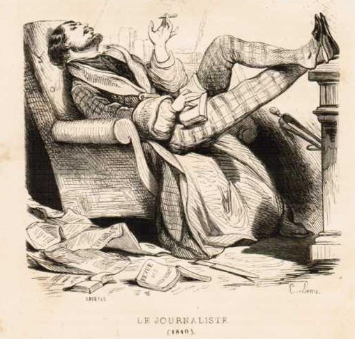

# All about Charles Eyre Pascoe (1842-1912)

 *I have yet to find a real picture of CEP, but this idealised image of "the Journalist" is one he might have appreciated. It appears first in a French collection dated 1840, but this would not have upset our man, who has a distinct fondness for the antiquarian*

This is the *Pascoe Portal*. It collects in one place all I have been able to discover about an obscure Victorian journalist and publisher of handbooks of various kinds. I came across him by way of his directory of living actors and actresses, *The Dramatic Register* (1879), which provides much interesting background for the plays published in Lacy's Acting Edition. And then I fell down a rabbit hole. Here's some of what I found there...

1. A [bibliography](https://lb42.github.io/Pascoe/CEP-bib.html) of books, pamphlets, letters, etc. attributed to Pascoe.
1. A [biographical sketch](https://lb42.github.io/Pascoe/CEP-bio.pdf) of his life
1. A [TEI conformant transcription](https://lb42.github.io/Pascoe/theDramaticList_1880.html) of the *Dramatic List* (2nd ed, 1880)
1. [Selected letters to the press](https://lb42.github.io/Pascoe/CEP-letters.html) on various topics
1. [Selected contemporary reviews](https://lb42.github.io/Pascoe/CEP-reviews.html) of his publications
1. [Newspaper reports](https://lb42.github.io/Pascoe/CEP-death.html) of his death following the announcement of his decease in the *Sutton and Cheam Advertiser* 15 Nov 1912, page 5.
